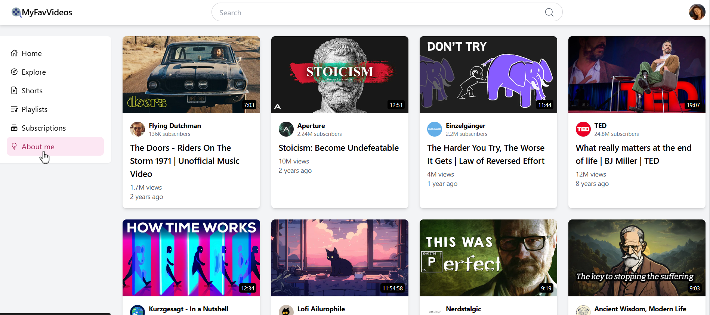

# MyFavVideos: Video Grid App

A React application that displays a responsive grid of video cards, showcasing thumbnails, channel information, and video details in an intuitive, user-friendly layout.

## Project Summary

**MyFavVideos** is a dynamic web app built to organize and present video content effectively. It features a responsive grid of video cards, a search bar, a navigation menu, and a portfolio section, providing users with an engaging way to explore videos, channels, and related details.

- **Deploy**: [Live Demo](https://my-fav-videos.vercel.app/)

## Screenshot

### App Overview

- This screenshot highlights the main page, featuring the video grid, search bar, menu, and portfolio section.

## Features
- **Responsive Grid Layout**: Adapts seamlessly to various screen sizes for optimal viewing.
- **Video Cards**: Display thumbnails, duration, and channel details for each video.
- **Channel Info**: Includes profile pictures and subscriber counts for quick reference.
- **Engagement Metrics**: Shows view counts and upload timestamps for context.
- **External Links**: Connects to videos and channels for easy navigation.

## Tech Stack
- **Next.js**: Framework for server-side rendering and efficient React development.
- **React**: JavaScript library for building dynamic user interfaces.
- **Tailwind CSS**: Utility-first CSS framework for rapid, responsive styling.

## Installation
1. Clone the repo: `https://github.com/evokss/MyFavVideos.git`
2. Install dependencies: `npm install`
3. Run the app: `npm run dev`
